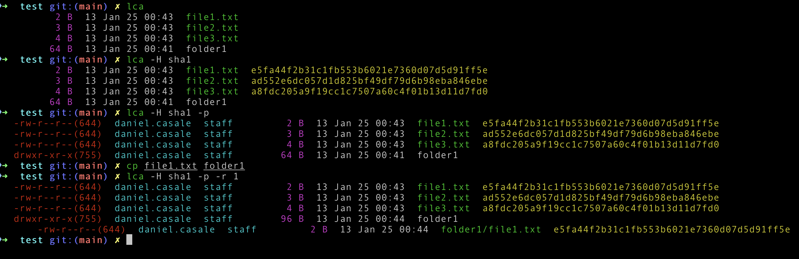

# lca

## Description

**lca** is an alternative to `ls` that computes file hashes, provides color-coded, user-friendly output, and supports configurable recursion depth. It uses Go to deliver robust performance and flexibility.


## Installation

### Using Debian Package

To install the `lca` Debian package, follow these steps:

1. Download the Debian package:

    #### Arch amd64
    ```bash
    wget https://github.com/dacalin/lca/raw/refs/heads/main/linux/deb/lca-latest-amd64.deb
    ```
    
    or 

    #### Arch arm64

    ```bash
    wget https://github.com/dacalin/lca/raw/refs/heads/main/linux/deb/lca-latest-arm64.deb
    ```
    
2. Install the package using `dpkg`:

    #### Arch amd64

    ```bash
    sudo dpkg -i lca-latest-amd64.deb
    ```

    #### Arch arm64
     ```bash
    sudo dpkg -i lca-latest-arm64.deb
    ```

### From Binaries
Binaries are pre-compiled for linux-amd64,linux-arm64, darwin-amd64 and darwin-arm64.
You can install it in your system by copying the right binary file manually or with the makefile:

1. Clone the repository:

    ```bash
    git clone https://github.com/dacalin/lca.git
    ```


2. Navigate to the project directory:

    ```bash
    cd lca
    ```

3. Install the right binary. It will read the system OS and ARCH and copy the right binary into /usr/local/bin directory:

    ```bash
    make just-install
    ```

### From Source

If you prefer to build `lca` from source:

1. Clone the repository:

    ```bash
    git clone https://github.com/dacalin/lca.git
    ```

2. Navigate to the project directory:

    ```bash
    cd lca
    ```

3. Build the project:

    ```bash
    make
    ```

4. Install the binary:

    ```bash
    sudo make install
    ```

## Usage

After installation, you can use `lca` via the command line:

```bash
lca [options]
```

### Examples

- **Display Help Information:**
    ```bash
    lca -h
    ```

- **Compute MD5 File Hashes:**
    ```bash
    lca --hash md5
    ```

- **Compute SHA1 File Hashes (Using Shorthand):**
    ```bash
    lca -H sha1
    ```

- **Show Permissions and Owners:**
    ```bash
    lca -p
    ```

- **Set Recursion Depth to 2:**
    ```bash
    lca -r 2
    ```

- **Combine Multiple Options:**
    ```bash
    lca --hash sha256 -p -r 3
    ```

## Contributing

Contributions are welcome! Please follow these steps:

1. Fork the repository.
2. Create a new branch:
    ```bash
    git checkout -b feature/YourFeature
    ```
3. Commit your changes:
    ```bash
    git commit -m "Add your message"
    ```
4. Push to the branch:
    ```bash
    git push origin feature/YourFeature
    ```
5. Open a pull request.

## License

This project is licensed under the [MIT License](LICENSE).

## Contact

For any inquiries or support, please contact [casale.candoit@gmail.com](mailto:casale.candoit@gmail.com).
